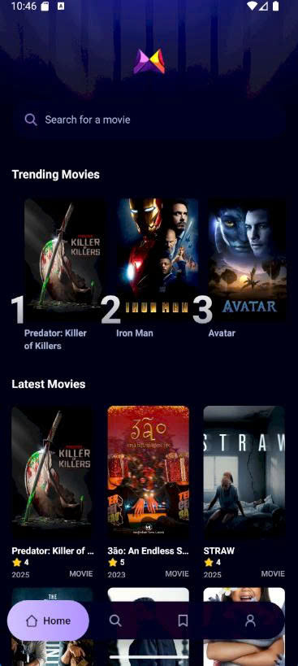
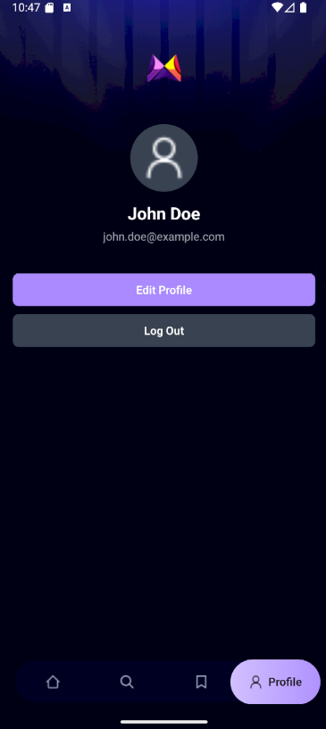
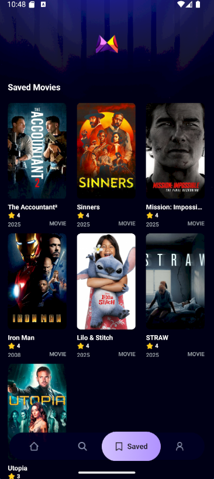
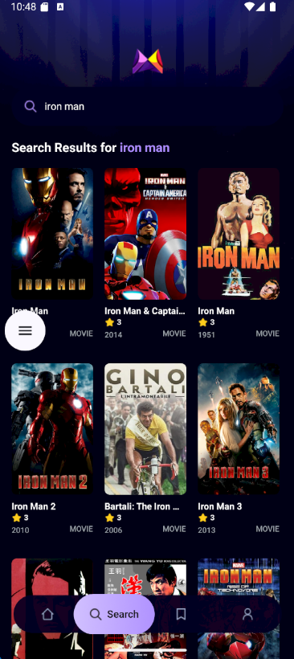

# 🎬 Movie App

**Movie App** là một ứng dụng mobile đơn giản được xây dựng với **React Native**, sử dụng **TMDB API** để lấy dữ liệu phim và **Appwrite** để lưu trữ thông tin phim đang phổ biến dựa vào các lựa tìm kiếm của người dùng cũng như các phim yêu thích.

## 🚀 Giới thiệu

Ứng dụng Movie App cho phép người dùng:
- Xem danh sách các bộ phim mới nhất
- Xem các phim **trending** dựa theo số lượt tìm kiếm của người dùng
- Tìm kiếm phim theo tên
- Xem chi tiết thông tin bộ phim
- Lưu phim vào danh sách yêu thích (Saved)

Ứng dụng có **giao diện người dùng đơn giản, dễ sử dụng**, phù hợp cho mục đích học tập và trình diễn dự án cá nhân.

## 🛠️ Công nghệ sử dụng

- [React Native](https://reactnative.dev/) – nền tảng chính để phát triển ứng dụng mobile
- [NativeWind](https://www.nativewind.dev/) - thư viện dùng Tailwind CSS trong React Native để tạo giao diện nhanh chóng và nhất quán
- [TMDB API](https://www.themoviedb.org/documentation/api) – để lấy dữ liệu về các bộ phim
- [Appwrite](https://appwrite.io/) – backend để quản lý dữ liệu phim đang phổ biến và lưu phim yêu thích

## ✨ Tính năng chính

- 🔥 **Danh sách phim Trending**  
  Hiển thị top các bộ phim được tìm kiếm nhiều nhất bởi người dùng.

- 🎞️ **Danh sách phim mới nhất**  
  Hiển thị các phim mới nhất từ TMDB.

- 🔍 **Tìm kiếm phim**  
  Người dùng có thể nhập từ khóa để tìm kiếm phim theo tên.

- ❤️ **Lưu phim yêu thích**  
  Người dùng có thể lưu những bộ phim yêu thích để xem lại sau.

- 📄 **Chi tiết phim**  
  Xem đầy đủ thông tin như tiêu đề, mô tả, poster, ngày phát hành,...

## 📁 Cấu trúc thư mục

movie_app/  
├── app/                 # Thư mục chứa các màn hình chính và định tuyến  
│   ├── (tabs)/          # Các tab chính trong ứng dụng (Home, Profile, Saved,...)  
│   │   ├── _layout.tsx      # Layout cho tab navigation  
│   │   ├── index.tsx        # Trang chính (hiển thị phim mới nhất và phổ biến)  
│   │   ├── profile.tsx      # Trang hồ sơ người dùng  
│   │   ├── saved.tsx        # Danh sách phim đã lưu  
│   │   └── search.tsx       # Trang tìm kiếm phim  
│   └── movies/          # Thư mục chi tiết phim  
│       └── [id].tsx         # Trang chi tiết phim (dựa trên ID)  
│  
├── assets/              # Tài nguyên tĩnh  
│  
├── components/          # Các thành phần UI tái sử dụng  
│  
├── constants/           # Các hằng số (icon path, image path,...)  
│  
├── interfaces/          # Định nghĩa kiểu dữ liệu/interfaces cho TypeScript  
│  
├── services/            # Gọi API và các hàm xử lý dữ liệu  
│   ├── api.ts               # Gọi tới TMDB API  
│   ├── appwrite.ts          # Cấu hình và hàm kết nối với Appwrite  
│   └── useFetch.ts          # Custom hook để fetch dữ liệu  

## 📷 Hình ảnh minh họa

### 🏠 Home Screen

### 👤 Profile Screen

### ❤️ Saved Movies

### 🔍 Search Screen

### 🎬 Movie Detail

## 📬 Liên hệ

- 👤 Tác giả: **Phạm Thanh Trí**  
- 📧 Email: [phamthanhtri0712@gmail.com](mailto:phamthanhtri0712@gmail.com)  
- 🌐 GitHub: [https://github.com/phamthanhtrivn](https://github.com/phamthanhtrivn)

---

> 🔧 *Dự án vẫn đang được phát triển và hoàn thiện thêm các tính năng nâng cao.*